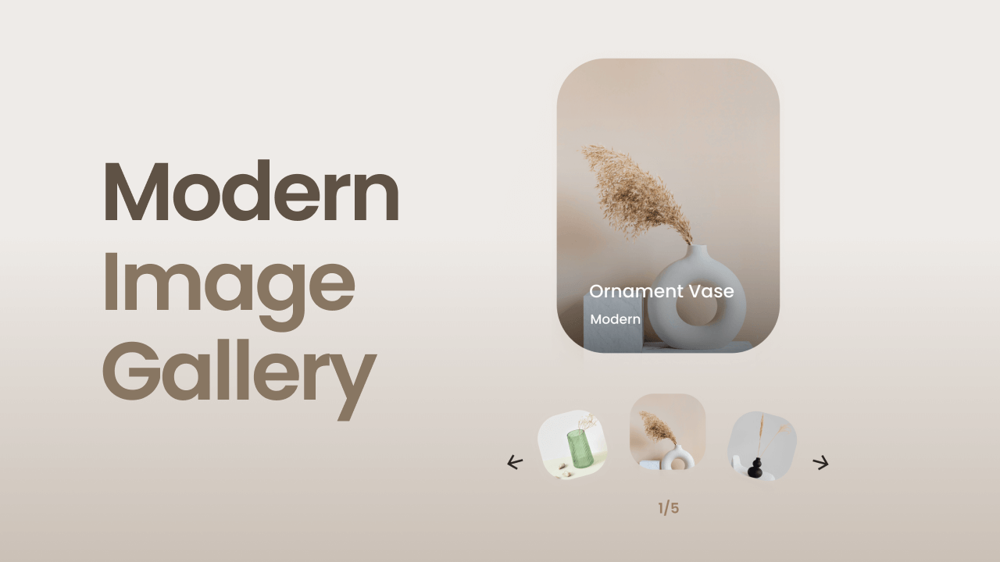

<div align="center">
      
    </a>
  <h3 align="center">Components - CSS / JavaScript</h3>
</div>

##  <br /> 📋 <a name="table">Table of Contents</a>

- ✨ [Introduction](#introduction)
- ⚙️ [Tech Stack](#tech-stack)
- 🚀 [Quick Start](#quick-start)

##  <br /> <a name="introduction">✨ Introduction</a>

[Preview](/.design)

**[EN]** This repository contains a collection of practice exercises built using only CSS and JavaScript, aimed at enhancing styling skills and understanding of core web development concepts. The collection includes various components, ranging from navigation bars and email validation to cards, dropdown menus, and more. 

**[FR]** Ce dépôt contient une collection d'exercices pratiques construits uniquement en CSS et JavaScript, visant à améliorer les compétences en stylisation et la compréhension des concepts fondamentaux du développement web. La collection inclut divers composants, allant des barres de navigation et de la validation des e-mails aux cartes, menus déroulants, et plus encore.


##  <br /> <a name="tech-stack">⚙️ Tech Stack</a>

- **HTML** (HyperText Markup Language) is the standard markup language used for creating web pages. It provides the structure of a webpage by defining elements such as headings, paragraphs, links, images, and other content. HTML elements are represented by tags, which tell the browser how to display the content.

- **CSS** (Cascading Style Sheets) is a style sheet language used to describe the presentation of a document written in HTML. CSS controls the layout, colors, fonts, and overall visual appearance of web pages. By separating content from design, CSS enables developers to maintain and update the visual style of multiple pages efficiently.
  
- **JavaScript** is a versatile, high-level programming language commonly used for web development. It enables interactive elements on web pages, such as dynamic content updates, form validation, animations, and user interface enhancements. JavaScript runs in the browser and is integral to building modern, interactive websites and web applications.

## <br /> <a name="quick-start">🚀 Quick Start</a>

Follow these steps to set up the project locally on your machine.

<br/>**Prerequisites**

Make sure you have the following installed on your machine:

- [Git](https://git-scm.com/)
- [Node.js](https://nodejs.org/en)
- [npm](https://www.npmjs.com/) (Node Package Manager)

<br/>**Cloning the Repository**

```bash
git clone {git remote URL}
```

<br/>**Running the Project**

Use [Live Server](https://marketplace.visualstudio.com/items?itemName=ritwickdey.LiveServer)
to launch a development local server with live reload feature for static & dynamic pages.